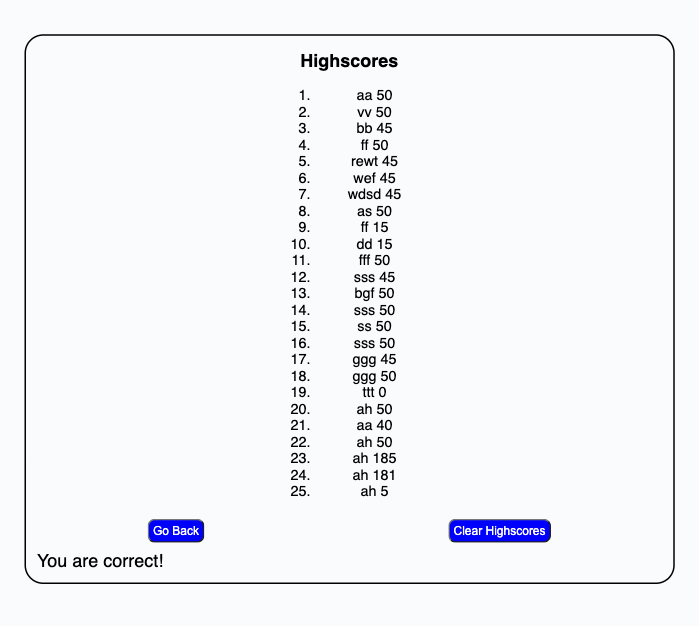

Selected quiz questions citation: https://www.interviewbit.com/javascript-mcq/

# Code-Quiz

## Description

This project was created in order to construct a JavaScript code quiz web application. 

## Installation

Installation is not required. The webpage is accessible from any web browser application.

## Usage

To use this service simply navigate to the website address below.

https://ahelmin.github.io/Code-Quiz/

To start quiz simply press the 'Start Code Quiz' button. You have 75 seconds to answer all 10 questions.

One the quiz has started, select the answers from a choice of four by pressing the correct button. Each right answer awards 5 points, while each wrong answer subtracts 10 seconds from the time. The final score is calculated by adding the score with the remaining time. This is a test of not only knowledge but also mouse dexterity.

You can navigate to the Highscores page at any time by clicking the View Highscores link on the top of the page.

Each time you are done with the quiz you can enter your initials and your score will be stored. When on the Highscore page, you can either choose 'Go Back' to start again, or 'Reset Highscores' to erase all stored scores.

## Credits

Thanks goes to the University of Minnesota and Edx Bootcamp for providing the assistance needed to complete this project. HTML code used was a rework from the Password-Generator starter code. A special thanks to R. Christensen for assistance with event listeners.

Some of the quiz questions used are from InterviewBit (https://www.interviewbit.com/javascript-mcq/).

## License

MIT License

Copyright (c) 2023 helm0127

Permission is hereby granted, free of charge, to any person obtaining a copy
of this software and associated documentation files (the "Software"), to deal
in the Software without restriction, including without limitation the rights
to use, copy, modify, merge, publish, distribute, sublicense, and/or sell
copies of the Software, and to permit persons to whom the Software is
furnished to do so, subject to the following conditions:

The above copyright notice and this permission notice shall be included in all
copies or substantial portions of the Software.

THE SOFTWARE IS PROVIDED "AS IS", WITHOUT WARRANTY OF ANY KIND, EXPRESS OR
IMPLIED, INCLUDING BUT NOT LIMITED TO THE WARRANTIES OF MERCHANTABILITY,
FITNESS FOR A PARTICULAR PURPOSE AND NONINFRINGEMENT. IN NO EVENT SHALL THE
AUTHORS OR COPYRIGHT HOLDERS BE LIABLE FOR ANY CLAIM, DAMAGES OR OTHER
LIABILITY, WHETHER IN AN ACTION OF CONTRACT, TORT OR OTHERWISE, ARISING FROM,
OUT OF OR IN CONNECTION WITH THE SOFTWARE OR THE USE OR OTHER DEALINGS IN THE
SOFTWARE.
